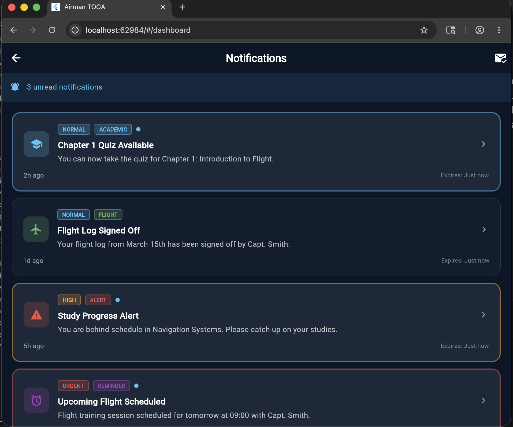

# AIRMAN TOGA - Cadet Mobile Module

A production-minded, feature-first Flutter mobile application module designed specifically for AIRMAN Aeronautics' aviation training ecosystems. This application serves as a dedicated platform for cadets to monitor flight training operations, check academic progress, capture study notes locally, and interact with aviation-specific modules.

## 📱 Application Screenshots

| Cadet Dashboard | Study Subjects | Notifications Layer |
| :---: | :---: | :---: |
|  |  |  |

---

## 📋 Table of Contents
1. Project Overview
2. Tech Stack Used
3. State Management
4. Folder Structure Explanation
5. Setup Instructions
6. How to Run the App
7. How to Run Tests
8. Mock Data Explanation
9. Local Storage Explanation
10. API Readiness Explanation
11. Known Limitations
12. Future Improvements
13. AI Usage Summary

---

## 1. Project Overview
TOGA is built to simulate real-world aviation workflows for flight academies. This module implements the client-side infrastructure required to handle Cadet Profile data, Home Dashboard metrics, Interactive Flight Course chapters, Local Offline Study Notes with real-time sync queues, Flight Logbook metrics, and Operational Notifications.

## 2. Tech Stack Used
* **Framework:** Flutter (Android & iOS cross-platform compatibility)
* **Language:** Dart
* **Local Caching:** Hive (Lightweight, blazingly fast NoSQL key-value store optimized for mobile devices)
* **HTTP Client Architecture:** Dio (Configured with abstract base clients to intercept network requests)
* **Navigation:** GoRouter (Declarative, type-safe path configurations for seamless view transitions)

## 3. State Management
This project utilizes **Riverpod** as its core state management framework.
* **AsyncValue:** Used across all dashboard views and lists to elegantly handle loading, success, and error fallbacks without polluting the UI layer with mutable flags.
* **StateNotifier / Notifier:** Drives the authentication session states and manages the offline sync queue state machines cleanly.

## 4. Folder Structure Explanation
The architecture follows a strict **Feature-First / Clean Architecture** methodology to ensure absolute scalability as the platform grows:

```text
lib/
├── core/                           # Shared configuration layers
│   ├── constants/                  # Layout configurations and asset mappings[cite: 1]
│   ├── theme/                      # High-contrast cockpit typography and palettes[cite: 1]
│   ├── network/                    # Dio client layers and REST mappings[cite: 1]
│   └── storage/                    # Hive storage boxes initialization[cite: 1]
├── features/                       # Modular business components[cite: 1]
│   ├── auth/                       # Cadet login and profile sessions[cite: 1]
│   ├── dashboard/                  # Main flight instruments, logs, and flight schedules[cite: 1]
│   ├── study/                      # Aviation courses, chapter lists, and AI tools[cite: 1]
│   ├── notes/                      # Offline study note creation and sync tasks[cite: 1]
│   ├── logbook/                    # Detailed hour tables (Solo, Dual, Cross Country)[cite: 1]
│   └── notifications/              # Flight and Academic operational notification items[cite: 1]
└── shared/                         # Global reusable interface blocks[cite: 1]
    └── widgets/                    # Status badges, spinners, and empty/error states[cite: 1]
```
## 5. Setup Instructions
Ensure you have the Flutter SDK configured on your machine (`flutter doctor` should verify green status).

Clone the repository and fetch the official packages:
```bash
git clone [https://github.com/ajaykrishnad/airman-toga-flutter-assessment.git](https://github.com/ajaykrishnad/airman-toga-flutter-assessment.git)
cd airman-toga-flutter-assessment
flutter pub get
```
## 6. How to Run the App
To boot up the production workspace in debug or profile mode:
```bash
# Run on connected emulator or browser environment
flutter run
```
## 7. How to Run Tests
The repository features automated domain unit verification components mapping data transitions. Execute them via:
```bash
flutter test
```
## 8. Mock Data Explanation
All app views communicate strictly with service layers that mock realistic payload contracts matching the provided schema targets[cite: 1]. The entities map directly to strongly-typed data objects featuring defensive fallback default parameters to eliminate unexpected null parsing exceptions across strings, integer progress metrics, and boolean toggle fields[cite: 1].

## 9. Local Storage Explanation
Local storage is driven using **Hive boxes**[cite: 1]. 
* When a user saves an offline study note, it is written immediately to the local cache box with a default status state of `SyncStatus.pendingSync`[cite: 1].
* The text input states utilize active structural binding forms to prevent loss of user data during active navigation across sub-routes[cite: 1].

## 10. API Readiness Explanation
The networking repositories are designed around abstract base interfaces[cite: 1]. This ensures that the mock repositories can be replaced immediately with real production network repositories connecting to a FastAPI python cluster using JWT headers, interceptors for automated refresh-token loops, and centralized REST handling strategies[cite: 1].

## 11. Known Limitations
* **Sync Simulation Automation:** The asynchronous synchronization loop is driven by randomized simulated API responses rather than true persistent web sockets[cite: 1].
* **State Interception Persistence:** Global states like notification read/unread configurations reset back to standard defaults if the global application cache data is deleted manually[cite: 1].

## 12. What You Would Improve with More Time
1. **True Offline Queue Sync Engine:** Implement a sequential background sync task loop using work managers that attempt automated background updates when device telemetry registers active network re-connections[cite: 1].
2. **Golden Widget Test Layout Sheets:** Implement automated visual snapshot unit testing to prevent text overlapping regressions across non-standard hardware viewports[cite: 1].
3. **Instructor Workflows Matrix:** Introduce custom role-based routers enabling immediate profile swapping mechanics to verify instructor-level progress tracking assignments[cite: 1].

## 13. AI Usage Summary
* **AI Tools Utilized:** Gemini, Windsurf, Stitch AI[cite: 1].
* **Automation Deliverables:** Accelerated initialization code mapping structures for specific data models, UI widget layouts, and basic dark mode color palettes[cite: 1].
* **Review Protocol:** Manually engineered defensive `fromJson` parameters to address validation type assertions, managed global Riverpod state bindings, and finalized feature architectural separations[cite: 1].